# **Bitki Bilgi Sistemi Mobil**

Uygulama 395 adet bitkinin bilgilerinin gösterildiği bir mobil projedir . Uygulama apk olarak kullanılabilmektedir. Google play store' a yüklenmeye hazır bir projedir.

# ****İÇİNDEKİLER****

-  [  **ÖZET** ](#ozet)

- [  **KULLANILAN TEKNOLOJİLER** ](#kullanilan-teknolojiler)

-  [  **HOME ACTIVITY** ](#home-activity)
	1. Home Fragment 

-  [  **LİST ACTIVITY** ](#list-activity)

-  [   **PLANT INFO ACTIVITY** ](#plant-info-activity)

	1. Genel Fragment

	2. Habitus Fragment

	3. Çiçek Fragment

	4. Yaprak Fragment

	5. Meyve Fragment

	6. Kullanım Alanları Fragment

	7. Kullanım Amacı Fragment

	8. Yetişme İsteği Fragment

	9. Diğer Bilgiler Fragment

## ÖZET

Genel olarak uygulama java ile android studio ortamında yazılmıştır. Dizayn işlemleri Adobe Photoshop ve Xd proğramlarından faydalanılarak tasarlanmış olup xml ile uygulamada gösterilmiştir. Uygulama java opp prensiplerinde yazıldi. Veri tabanındaki tablolar 9 tanedir ve bir bitkinin sahip olabileceği tüm bilgiler mevcuttur. Bunlar genel, habitus ,çiçek, yaprak ,meyve, kullanım alanları , kullanım amacı ,yetişme isteği ve diğer bilgiler olmak üzere 9 tane tablo yapısı bulunmaktadır. Fragment yapıları ve navigation yapısı kullanılmıştır. Bu sayede bilgilere erişim oldukça hızlıdır ve uygulama son derece akıcıdır.

## KULLANILAN TEKNOLOJİLER VE ARAÇLAR

###### **Yazılım Dilleri :** Java, Php, Sql ,Xml

###### Kullanılan Proğramlar : Android Studio ,Visual Studio Code ,Adobe PhotoShop ,Adobe Xd ,Zeplin ,DB Browser Sqlite ,PhpMyAdmin

## Home Activity

#### Home FragmentHome Fragment
- Bu aktivite navigation yapısını barındırır. 2 tane fragment kullanıldı 1. home fragment , 2. İnfo fragment.
- Bu aktivite uygulama ilk açıldığı zaman karşımıza gelen aktivitedir.
- Ağaç resmi bir .gif yapısı olarak tasarlanmıştır.
- Bitkiler butonu basıldığında bir sonraki bitkilerin listelendiği aktivite açılmaktadır.
- Qr kod butonu ise bitkilerin bilgileri göstermek için qr code okuyucu kameranın açılıp okunan bilgilere göre bitkinin gösterilmesi için düşünüldü . 
- İnfo butonu ise uygulama hakkında bilgilerin gösterildiği butondur.

	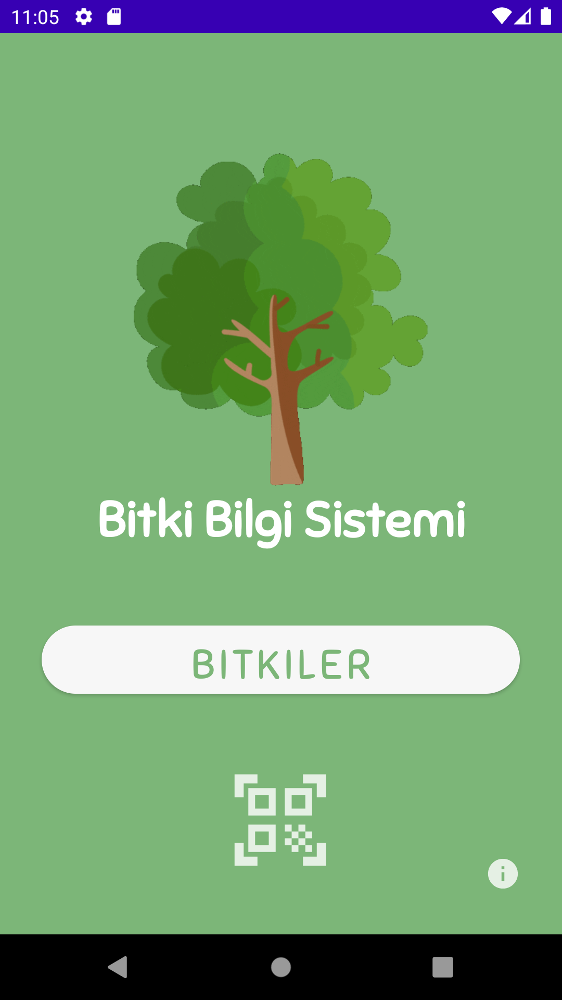

#### List Activity

- En başta bulunan yine home aktiviteye dönüş butonudur.
- Hemen sağında ise search view olarak kullanılan bitki arama için tasarlanmış bir arama bölümü bulunuyor.
- List view yapısı olarak alt bölümde bir listeleme bulunuyor.
- Bu listede 395 tane bitkinin veri tabanında bulunan latin name türündeki tablosundan veriler listeleniyor.
- Bu listede görünen bilgiler bitkilerin latince isimleridir.
- Göstermek istediğimiz biktiye tıklamamız yeterli olacaktır bizi direk o bitkinin bilgilerini görebilileceğimiz plant info aktivitesine yönlendirecektir.
- Search bar a herhangi bir metin girdiğimizde bize tekrardan bir liste oluşturuyor.
- Bu arama veri tabanından dinamik olarak sorgularla yapılıyor.
- Girilen metne göre latince ismin içinde geçmesi yeterli olacaktır bize direk o bitkiyi getiriyor.
- Aynı şekilde listede herhangi bir bitkiye tıkladığımız da bize onun bilgilerini getiriyor.

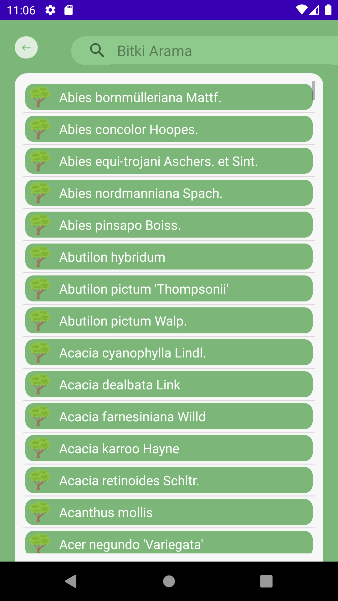

#### Plant Info Activity

- Burada örnek arama yaptığımızda ve Chorisia speciosa bitkisine tıkladığımızda bize Plant Info Activity
- Tıklananan bitkiye ait bilgiler ise plant info activitesinde gözükmektedir.
- Bu aktivitede back butonu list activitesine geri dönüp bitki araması yapmak için kullanılıyor.
- Bitkinin adı üst başlık olarak aktarılıyor ve gösteriliyor.
- Tap Layout bulunuyor burda bitkiye ait özellikler mevcut bunlar sıralanırsa :
- Genel, Habitus, Çiçek, Yaprak, Meyve,Kullanım Alanları, Kullanım Amacı, Yetişme isteği, Diğer Bilgiler
- Bunlar veri tabanında ayrı olarak 9 tane tablo olarak tutuluyor.
- Her tablonun kendisine ait özellikleri bulunuyor. Ve bunlar özenle doğru bir şekilde listeleniyor.
- Horizontal Scrool View içerisinde bu 9 tane tablo listelendi bunlar kaydırılarak geçilebiliyor.
- Bunlara tıklandığında alt bölümde yine o tabloya ait fragmentlar bulunuyor. Fragmentlar 9 tane tablolara eş değer bir şekilde oluşturuldu. Bunun yanında Manager sınıflarıyla veriler OOP prensipleriyle dinamik olarak çekildi ve uygulamada gösterildi.

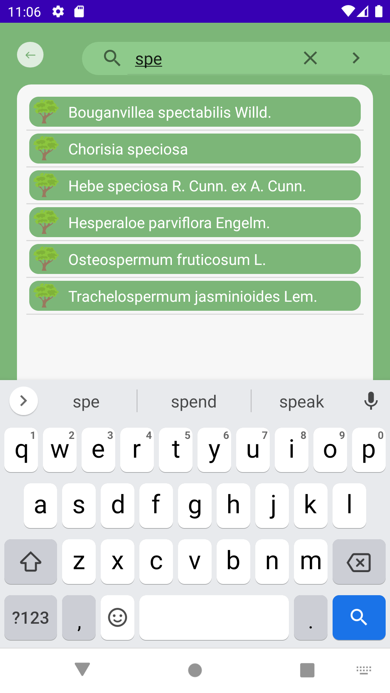
	
#### Genel

- Genel tablosunda fotoğraftaki örnek bitkideki bilgiler bulunuyor.
	1. Latince İsmi
	2. Türkçe İsmi
	3.  Büyüme Formu
	4. Anavatanı
	5. Yetiştiği Bölge
	6. Ailesi
	7. Genel Hakkında Notlar

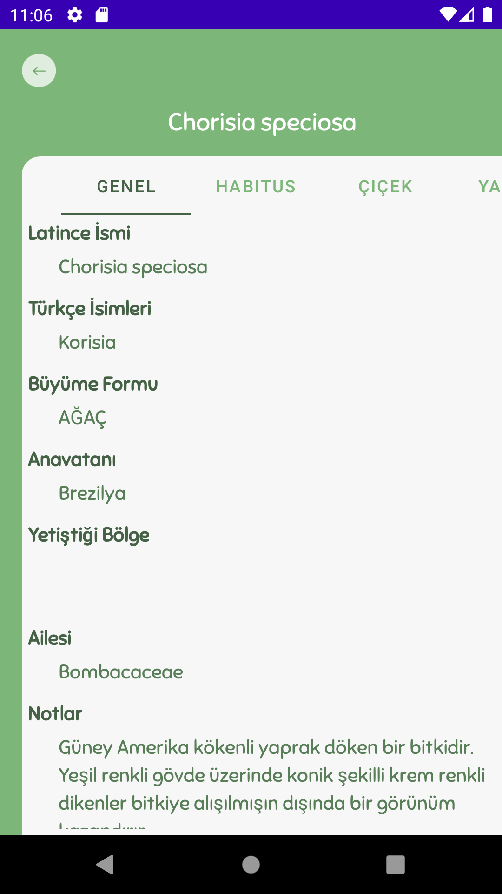

#### Habitus

- Örnek aramada habitus alanına geçiş yaptığımızda bitkinin habitusuna ait bilgiler dinamik olarak gösteriliyor.
	1. Bitkinin Şekli
	2. Bitkinin Boyu
	3. Bitkinin Çapı
	4. Bitkinin Dokusu
	5. Habitus Hakkında Notlar
	

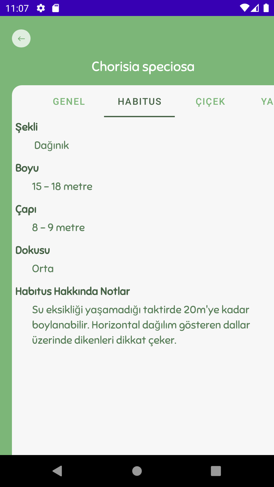
	
#### Çiçek

- Çiçek bölümünde çiçek tablosunda bilgiler gösteriliyor.
	1. Çiçek Durumu
	2. Çiçek Büyüklüğü
	3. Çiçek Kokusu
	4. Çiçek Rengi
	5. Çiçeklenme Zamanı

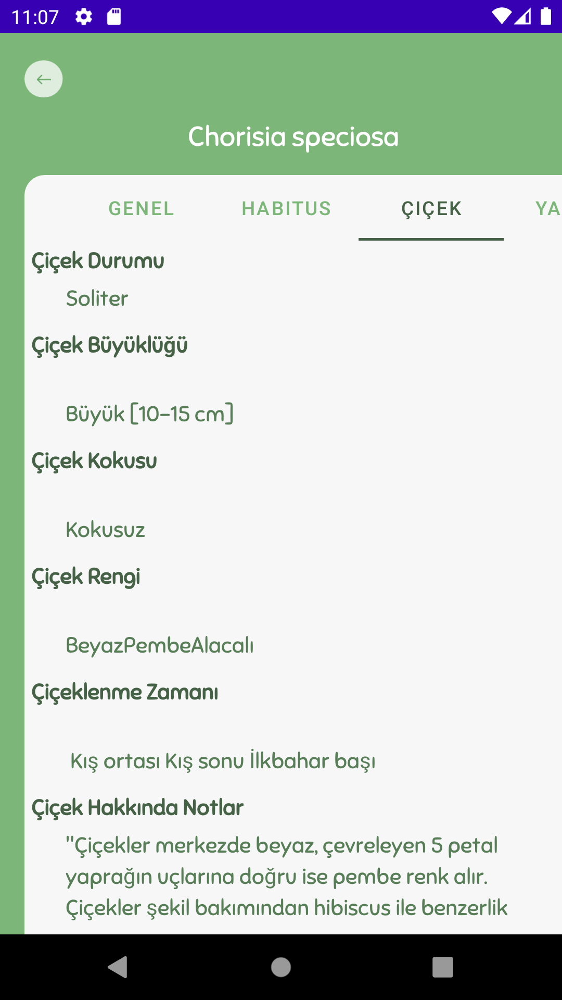

#### Yaprak

- Yaprak bölümüne tıklandığında yaprak tablosundaki veriler listelenmekte
	1. Yaprak Dökme
	2. Yaprak Tipi
	3. Yaprak şekli
	4. Yaprak Büyüklüğü
	5. Yaprak Kokusu
	6. Yaprak Dokusu
	7. Yaprak Rengi
	8. Yaprak Güz Rengi
	9. Yaprak Hakkında Notlar

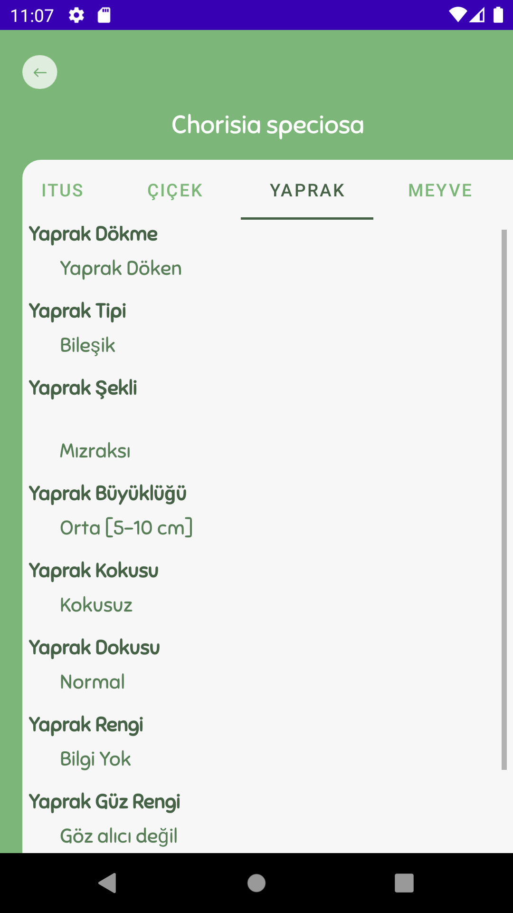
	
#### Meyve

- Meyve bölümüne geçtiğimizde burada meyveye ait bilgiler gösteriliyor.
	1. Meyve Durumu
	2. Meyve Tipi
	3. Meyve Büyüklüğü
	4. Meyve Rengi
	5. Meyve Yenilebilirliği
	6. Meyve Zamanı

	
	
#### Kullanım Alanları

- Kullanım Alanları bölümüne geçildiğinde bitkiye ait kullanım alanları bilgisi gözükmekte.
	1. Kırsal Kullanım Alanları
	2. Kentsel Kullanım Alanları
	3. Diğer Kullanım Alanları
	4. Peyzaj Tarzı
	5. Kullanıma İlişkin Notlar

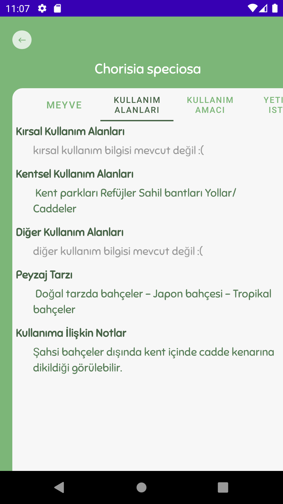

#### Kullanım Amacı

- Kullanım amacında ise kullanım amacı bilgileri gözükmekte bunlar,
	1. Bitkinin Mühendislik İşlevleri
	2. Bitkinin Mimarlık İşlevleri
	3. Bitkinin Ek Özellikleri

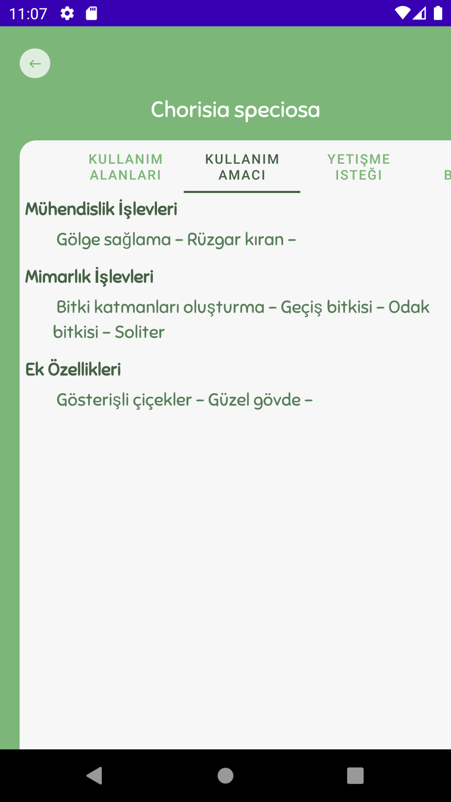
	
#### Yetişme İsteği

- Yetişme isteği bölümüne tıklandığında bitkinin hangi şartlar altında yetişmek istediği bilgileri gözükmekte.
	1. Gün Işığı İsteği
	2. Su İsteği
	3. Besin Gereksinimi
	4. Toprak İsteği
	5. Toprak Drenajı

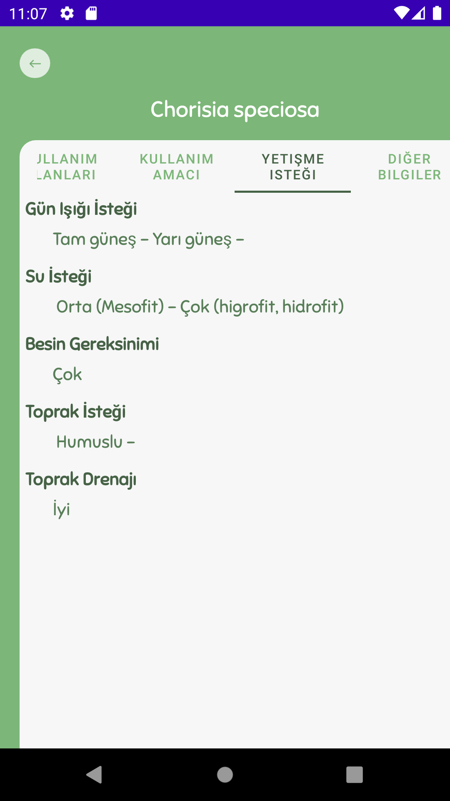

#### Diğer Bilgiler

- Diğer bilgiler bölümünde ise bitkinin diğer önemli olan özellikleri bulunuyor.
	1. Büyüme Hızı
	2. Bakım İhtiyacı
	3. Zehirlilik
	4. Üretimi

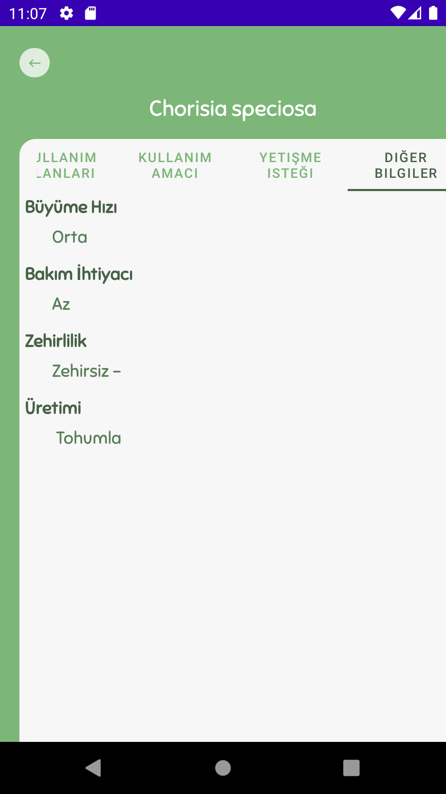
	
	
